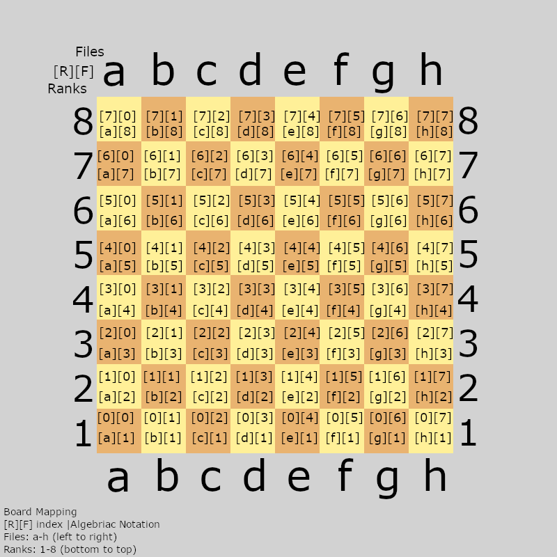

# Board Coordinate System

This is the internal board representation used in `Cpp-Chess`.

- The board is modeled using a `board[rank][file]` format
- Index `[0][0]` corresponds to `a1`
- Files (`a` to `h`) increase left to right
- Ranks (`1` to `8`) increase bottom to top
- The full board is indexed from `[0][0]` to `[7][7]`

## Visual Reference

Each square shows:
- `[R][F]` index (rank, file)
- Algebraic notation (`a1`, `b2`, etc.)